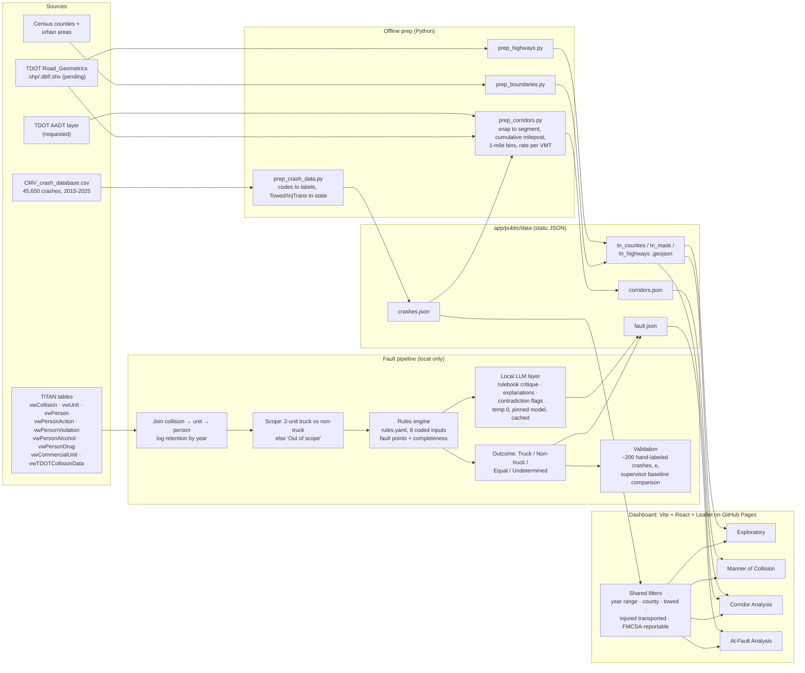

# Meeting notes: 2026-09-24 (supervisor)

Architecture diagram at the bottom of this doc. Implementation detail lives in
`PLAN_2026-09-24_meeting.md`.

## Dashboard fixes (existing build)

- Add two indicator variables to the database/filters: one for tow-away crashes, the
  other possibly "evacuation IND." Exact field names were not confirmed in the meeting,
  but indicator fields end in "IND."
  - **Confirmed in the data:** `vwCollision.TowedInd` and `vwCollision.InjuredTransInd`
    (injured person transported; this is the "evacuation IND"). Also present:
    `vwUnit.FMCSAReportableInd`.
  - Fill rates in the CMV extract: `TowedInd` Y 29,282 / N 1,362 / blank 15,006;
    `InjuredTransInd` Y 15,721 / N 21,622 / blank 8,307. Blank is not "No", so each
    filter needs three states: Yes / No / Not recorded.
- In the Exploratory Analysis tab, the charts next to the map respond to the top year
  filter, but the lower charts always show "full data set." Make them follow the filter.
- The supervisor photographed the whiteboard before erasing it.

## Logistics

- The professor meeting is still Tuesday (9/29), remote. The invite comes after today.
  The agenda isn't set, but "they want to see the dashboard."
- The assistant first thought Tuesday fell in fall break, then corrected: fall break is
  the following week (week of 10/5).
- Deadline to show something by the end of the month (9/30).

## New tab 1: Manner of Collision (working name)

- Layout matches the current dashboard: map on the left, year filter on top.
- A menu picks manners of collision (e.g., rear-end), with multi-select allowed.
  Dropdown vs. checkboxes is undecided. The map filters to match.
- A severity distribution bar chart with values shown, ordered least to most severe:
  property damage (2 categories), injury (3), fatal. Called "low-hanging fruit."
- A summary sentence: "For [selected time range], [manner] was most frequent, [manner]
  had the most injuries, [manner] the most fatalities." This doesn't change with the
  manner filter, only the year. Users see which manner dominates, then look at where
  those crashes are.
- Optional: click a county to focus all outputs on it. Unsure how messy that gets; the
  assistant will try it.
- Standing permission: add anything clever without asking.

## New tab 2: Corridor Analysis (working name)

- Confirmed that a year range like 2024-2024 returns only 2024.
- Back end: join crashes to the roadway geometrics (highway segment) file by nearest
  segment. Each crash is assigned to exactly one segment.
- Result is the geometrics table with a crash count per segment, then totals by route.
  Field name was unclear in the meeting (route, corridor, or highway name).
  - **Confirmed from the shapefile metadata:** the route field is `NBR_RTE`, with
    `NBR_TENN_CNTY`, `CNTY_SEQ`, `RD_BEG_LOG_MLE`, `RD_END_LOG_MLE`, `LOG_MLE_LENGTH`.
    No AADT field.
- Front end: the map shows only the highway network. A dropdown or type-ahead search
  selects a highway, which is then highlighted, with the same severity info shown for it.
- Called potentially the "most value" feature; never built before. The geometrics file
  is split into small pieces (tenth-mile to half-mile). Plot crashes along the whole
  route from first segment to last as a bar chart, e.g., I-40 from Memphis to Bristol.
  Expect spikes at Memphis, Nashville, Chattanooga, and Knoxville, plus "problematic
  areas." Label city extents if feasible; expected to be hard.
- Feedback from other professors comes after it's implemented.

## Fault analysis

- Reference paper is "almost exactly what we're looking for." It used 1990s North
  Carolina data and all crashes, not only trucks.
- Our data: 2015-2025, and the supervisor can download the full 2025 set. Data quality
  was described as not very good.
- Planned as the third dashboard section, after manner of collision and corridor. The
  Tennessee crash database (TITAN) has three main tables:
  - Collision (police report): how the crash happened, conditions.
  - Unit/vehicle (DMV).
  - Person (DMV): intoxication, speeding, action, violations.

### Steps (supervisor's plan)

1. Merge collision, unit, and person. Records drop at each join (e.g., 10,000 becomes
   8,000 and then fewer), especially in older years. Keep only complete records.
2. Split into severity buckets: fatal, injury (3 types), property damage (2 types).
3. Score 8 variables, the same for all buckets: vehicle maneuver, impact code, road
   surface condition, alcohol presence (tests unreliable), driver license status
   (revoked/expired), drug presence (unreliable), action code ("most important"), and
   person violation.
4. Scoring works on two-vehicle, truck-vs-car crashes. Both drivers start at 100%
   "innocence," and rule-based deductions follow. Example: car rear-ends truck means a
   deduction for the car, unless the truck driver "did something dumb."
5. The rule score (RS) is a weighted sum of infractions, bounded 0-1. The lower score is
   more at fault (e.g., 30 vs. 80 means the 30 is more at fault).
6. Needs boundary conditions for "about equal" and "neither at fault," e.g., wet road.
7. Output is a percentage at fault by severity bucket. The user selects truck driver /
   non-truck driver / undetermined / equal fault, and results appear on the map.

### Assistant's proposal

- Score upward instead of deducting: points added for fault, so "80% at fault" reads
  naturally, equal to 100 minus innocence. The supervisor agreed it's more intuitive.
  Add a text summary of what the map shows.
- LLM agentic workflow, based on the assistant's internship work on health-insurance
  liability decisions:
  - Variables plus rules go into a "bank," a RAG store. The assistant claimed this
    confines the LLM to given rules with no outside knowledge or bias.
  - Send to Claude, chosen for reasoning.
  - Specialized "baskets" per variable group, e.g., alcohol plus drugs. Each writes a
    summary and applies threshold rules, e.g., "subtract 10% for alcohol."
  - One basket per variable is more reliable, but costs more tokens and runs slower.
  - Claimed it "learns from itself" from a labeled set of known-fault crashes and adapts
    as trends change, unlike a fixed formula.
  - Inputs needed: the variables plus a short rule set per category.
- The supervisor asked if this is supervised learning. The assistant: "not exactly," a
  sandbox of provided truth.
- Budget: no money for API calls. The supervisor asked about an offline Claude. The
  assistant said open-source local models are "completely free and just exactly the
  same." Running locally is fine for a dashboard; the API is "more of an enterprise
  thing."
- Timeline: 1-2 weeks writing the system prompt ("God file"), about 1 week of
  "training"/stress-testing including junk data to catch sycophancy, 2-3 weeks total.
  The assistant would have Claude build the baskets and supervise it.
- Add Honcho as a persistent memory layer, so the model keeps its instructions and past
  precedents over long runs. Used by the assistant over the summer.
- Explainability: pull reasoning from the memory layer, or a separate summary basket
  that outputs the conclusion plus the reason.

## Decisions

- The supervisor adopted the assistant's approach: "aligns perfectly with what the
  client wants," and funders will like AI.
- The supervisor sends the data "today, tomorrow," by Monday (9/28) at latest.
- The supervisor builds a "very basic" version separately for the end-of-month show
  ("nobody will question it"). The assistant's system takes over later.
- The assistant prepares about 5 slides: approach, timeline, and a final slide of
  expected output (what users select and see on the map). The assistant presents on
  Tuesday.
- Warning: early-year alcohol/drug fields are mostly unknown or missing.

## Position and PI

- The assistant's position ends in December; they asked about spring. The project runs
  two more years and the supervisor thinks two years of students were budgeted. The
  supervisor will ask Dr. Shawn tomorrow and may offer spring, possibly fall too.
- Zoom tomorrow (9/25) at 11:00 with Dr. Shawn. He "talks a lot" and "always has
  feedback."

## Action items

| Owner | Item | Due |
|---|---|---|
| Supervisor | Send collision + unit + person data (incl. full 2025). **Received 10/5, person tables partial; see below** | Mon 9/28 |
| Supervisor | Send Road_Geometrics `.shp/.dbf/.shx` (only metadata on disk) | ASAP |
| Supervisor | Ask Dr. Shawn about spring (and fall) funding | Fri 9/25 |
| Supervisor | Basic fault version for end-of-month show | Wed 9/30 |
| Supervisor | Send professor-meeting invite | Before 9/29 |
| Assistant | Tow-away + injured-transported filters, tri-state | Before 9/29 |
| Assistant | Lower Exploratory charts follow year filter | Before 9/29 |
| Assistant | Manner of Collision tab (county click optional) | Before 9/29 |
| Assistant | Corridor tab, interim version on placeholder geometry | Before 9/29 |
| Assistant | ~5 slides on fault approach; send to supervisor for review | Mon 9/28 evening |
| Assistant | Get reference paper PDF; confirm it's Council et al. (2003) | Before 9/29 |

## Files received 10/5 (`~/Desktop/FMCSA Related Crashes`)

What arrived: `CMV_crash_database.csv` (the collision table, 45,650 crashes, same as
before), `Unit.csv`, `CommercialUnit.csv`, `CommercialUnitHAZMAT.csv`, `Insurance.csv`,
`Person.csv`, `Person_Detail.csv`, `Person_Action.csv`, `Person_Alcohol.csv`,
`Person_Drug.csv`, `Person_Condition.csv`, `Person_Violation.csv`,
`Person_Endorsemnt.csv`, and the 2012 TITAN data dictionary PDF.

Not included: the Road_Geometrics `.shp/.dbf/.shx`, the AADT layer, the reference paper.

**The person tables in this extract are incomplete.** Crashes covered, by year:

| Year | Crashes | Unit | Person | Person_Action | Person_Violation |
|---|---|---|---|---|---|
| 2015 | 3,340 | 53 | 0 | 0 | 0 |
| 2016 | 3,418 | 1,673 | 0 | 0 | 0 |
| 2017-2019 | 10,924 | all | 0 | 0 | 0 |
| 2020-2022 | 15,553 | all | 34 | 7 | 3 |
| 2023 | 5,377 | all | 812 | 80 | 38 |
| 2024 | 4,902 | all | 3,118 | 343 | 160 |
| 2025 | 1,168 | all | 737 | 81 | 32 |
| **Total** | 45,650 | 40,496 | 4,806 | 511 | 233 |

- Person data exists for 4,806 crashes (10.5%), nearly all 2023-2025. Action code, the
  "most important" variable, exists for 511 crashes (1.1%).
- Unit data is missing for almost all of 2015 and half of 2016.
- `Person_Endorsemnt.csv` is a byte-for-byte copy of `Person_Alcohol.csv` (same header
  too). The real endorsement table didn't export.
- `Unit.CommercialVehicleInd` is blank in every row. Identify the truck through
  `CommercialUnit.csv` instead.
- The 8 unit-level variables are fine where units exist: `ManeuverCde`, `FirstImpactCde`
  and `SurfCondCde` are each 12.6% blank.
- `AlcoholPresenceCde` and `DrugPresenceCde` are blank for 26% of person-detail rows;
  `DLStatusCde` is blank for 49%.

**The earlier TITAN export already has full coverage.** The `vw*.txt` tables from the
9/22 OneDrive zip (`TITAN Crash Database (Processed)/`) cover every CMV crash in every
year: `vwPerson` and `vwUnit` 45,650 of 45,650, `vwPersonAction` 45,478, and
`vwPersonViolation` 16,497 (violations are rarer by nature). The fault groundwork (74.5%
single-driver coverage) was built on those.

**What this means for the plan:**

- The supervisor's "records drop at each join, especially older years" is most likely
  an artifact of how this extract was pulled (a filter or row limit on the person
  query), not of the database. Joined against the full export, the drop is small.
- "Keep only complete records" on this extract would leave roughly 500 crashes, almost
  all 2024. A fault analysis on that can't speak to 2015-2025.
- Use the full `vw*.txt` export for the fault pipeline. Use the new files only to check
  that codes and joins agree for the overlapping crashes.
- Ask the supervisor how the person tables were exported, and whether the full export
  is the one the client expects us to use.

**Supervisor's answer (10/5):** some of the data is old, so it will be incomplete, but
it's all we have and we work with it. Still open: whether the full 9/22 `vw*.txt`
export (which covers all years) counts as "what we have" or was set aside on purpose.

## Open questions for the supervisor

1. Is `InjuredTransInd` the "evacuation IND" you meant? Should the dashboard offer a
   single "FMCSA-reportable only" toggle (fatal OR towed OR injured transported)?
2. Does the data-use agreement allow person (DMV) records to go to a commercial API?
   If not, the LLM layer must run locally, and the slides should say so.
3. Can we get the TDOT AADT (traffic count) layer? Without it, corridor counts can't be
   turned into crash rates.
4. Who labels the validation sample, and how many crashes?
5. Boundary thresholds: what gap counts as "about equal," and what floor counts as
   "neither at fault"?
6. How were the 10/5 person tables exported? They cover 10.5% of crashes, mostly
   2023-2025, while the full TITAN export covers all years. Which one should the fault
   analysis use? And can you re-export the endorsement table (the file sent is a copy
   of the alcohol table)?

## What this means

**The client context nobody said out loud.** FMCSA regulates motor carriers. Truck
crashes count against carriers in CSA/SMS scores regardless of fault. The Crash
Preventability Determination Program exists because of that. A defensible "who was at
fault in truck/car crashes" analysis is the policy payload here. The two map tabs are
supporting work. The fault method will be judged on defensibility and reproducibility,
not novelty.

**The reference paper** is probably Council et al. (2003), "Examination of Fault, Unsafe
Driving Acts, and Total Harm in Car-Truck Collisions" (Transportation Research Record
1830), which used North Carolina data. The supervisor's plan copies its logic:
code-based fault assignment by severity. Checking the paper settles this, and its fault
rules are a ready-made starting rulebook.

**Most of the pitch's technical claims are wrong.** The supervisor didn't have the
background to catch them.

- An LLM doesn't learn from itself during use. Without fine-tuning, the "week of
  training" is prompt iteration and testing.
- RAG doesn't stop the model from using what it learned in training.
- Open-weight local models aren't "exactly the same" as Claude, and Claude has no
  offline version.
- Honcho is a memory/personalization layer. It doesn't make results reproducible.
- Dr. Shawn or the other professors are likely to probe exactly these points on Tuesday.

**All 8 inputs are coded categorical fields.** Turning codes into fault points is a
lookup table. An LLM adds cost, run-to-run variation, and slowness to what a
deterministic rule set does exactly. The LLM earns its place in three narrow jobs:
drafting and critiquing the rulebook, writing the per-crash explanation text, and
flagging contradictory records for review.

**The two plans are complementary, not rivals.** The supervisor's "basic" version is the
baseline the LLM must beat. Frame Tuesday as "rules engine plus LLM layer, validated
against the rule baseline," not "LLM replaces rules." That's safer and more credible.

**The "labeled test set with 100% known fault" doesn't exist in this data.** "Person
violation" (citation issued) is the closest proxy, and it's also an input. Using it as
both input and label is circular. Without independent ground truth, "accuracy" can't be
reported. The fix is a hand-labeled stratified sample (~200 crashes, two independent
raters, report inter-rater agreement), with violation kept out of either the inputs or
the label.

**Running locally helps on data privacy.** The person table is DMV-sourced personal
data. The data-use agreement likely forbids sending it to a commercial API. Local is
probably required, not just cheaper, and the slides should say so.

**Scale.** The extract has 45,650 TN CMV crashes (2015-2025), 40,349 of them
multi-unit. Several baskets per crash on a laptop model means hundreds of thousands of
calls. The "2-3 weeks" covers building the pipeline, not running and validating it.

**Coverage ceiling.** Across the 40,349 multi-unit CMV crashes, exactly one driver
carries a fault signal (action code or violation) in 74.5%, no driver in 19.8%, two or
more in 5.5%. Roughly three quarters is the ceiling for any method, set by officer
recording practice. Of the cleanly attributed crashes, the non-truck driver carries the
signal 59.9% of the time.

**Missing is not innocent.** Unknown alcohol/drug codes in early years must not read as
"no fault." Track evidence completeness per driver and push low-completeness crashes to
"Undetermined."

**Never infer fault from outcome.** Severity follows mass, not culpability. A rule that
leans on severity will systematically blame the lighter vehicle. Severity is a bucket
for reporting, never a scoring input.

### Corridor analysis

- Raw counts per segment mostly track traffic volume, so the city spikes will appear
  and prove nothing. Separating "problematic areas" requires crash rates per
  vehicle-mile (AADT times length), or expected-vs-observed crash counts.
- Segments vary from 0.1 to 0.5 mi, so bars per segment compare unequal lengths. Use
  fixed mile bins.
- Tennessee's TDOT log miles reset at each county line. Ordering "Memphis to Bristol"
  needs a cumulative milepost built across counties (order county pieces by `CNTY_SEQ`).
- Crash records were expected to carry route and log mile, which would beat
  nearest-segment snapping (snapping puts crashes at interchanges and overpasses on the
  crossing road). **Checked: they mostly don't.** Of ~20k interstate crashes, 18,009
  have a blank `RdwyNbrTxt`, and on I-40, 525 of 734 labeled crashes have no
  `MileMarkNmb`. The join has to be spatial, with the route number used as a filter
  when present. `vwTDOTCollisionData` (`Route`, `LogMile`) is worth checking for
  coverage as a better key.

### Severity and FMCSA criteria

- Severity categories follow the KABCO scale. Tennessee reports: Fatal; Suspected
  Serious Injury; Suspected Minor Injury; Possible Injury; Property Damage Over;
  Property Damage Under (the reporting threshold).
- The two indicators map to FMCSA's reportable-crash criteria: a fatality, an injured
  person transported for immediate medical care, or a vehicle towed from the scene. The
  dashboard may be meant to filter to FMCSA-reportable crashes.

## Architecture diagram

Key choices the diagram encodes:

- Everything heavy runs offline; the site is static, so no server and no API cost.
- One crash-level `crashes.json` with filtering in the browser, so every chart and map
  follows the same filters (this is the fix for the "full data set" charts).
- The fault pipeline never leaves the local machine (DMV person data). The rules engine
  produces the answer; the LLM only explains, critiques, and flags.
- Corridor rates need AADT; until it arrives the profile shows crashes per mile,
  labeled unnormalized.
